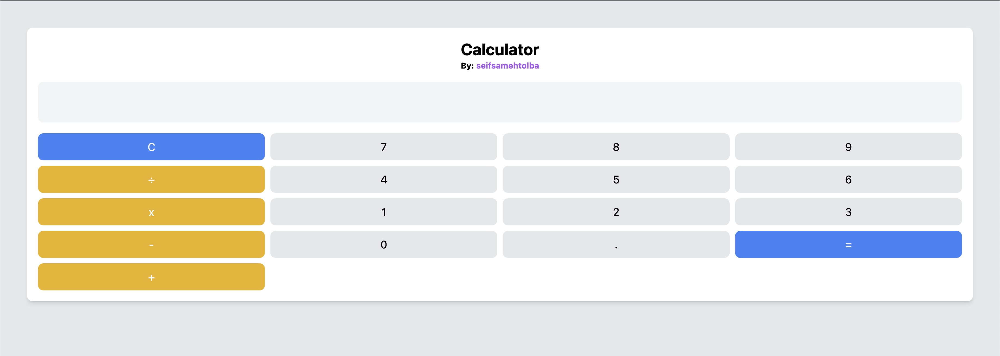

# Calculator

A cool and easy-to-use calculator made using HTML, Tailwind-CSS, and JavaScript. The calculator features a clean and modern design, with various colors to distinguish between operations.

## Features

- Perform arithmetic operations such as addition, subtraction, multiplication, and division
- Calculate percentage values
- Evaluate complex expressions with parenthesis and order of operations
- Handle negative numbers
- Error handling and display of meaningful error messages

## Technologies Used

- HTML
- CSS
- JavaScript

## Live Demo

Visit [this link](https://seifsamehtolba.github.io/calculator/) to view the live demo of the calculator.

## Getting Started

1. Clone this repository using `git clone https://github.com/seifsamehtolba/calculator.git` or download the ZIP file and extract it.
2. Open the `index.html` file in your web browser to view and use the calculator.

## Usage

1. Enter the first operand or the number you want to perform an operation on.
2. Select an operation (+, -, x, ÷, or %).
3. Enter the second operand or the number you want to perform the operation with.
4. Press the '=' button to get the result.

Please note that the calculator supports the standard order of operations. For example, multiplication and division have higher priority than addition and subtraction. To enforce a different order of operations, use parentheses.

## Contributing

Pull requests are welcome. For major changes, please open an issue first to discuss what you would like to change.

Please make sure to update tests as appropriate.

## License

This project is licensed under the MIT License - see the [LICENSE](LICENSE) file for details.